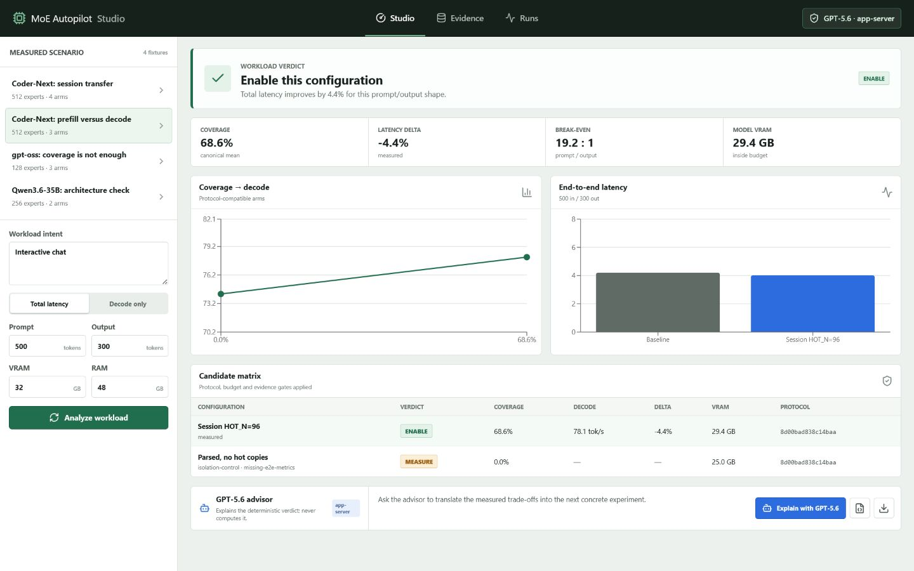

# MoE Autopilot Studio

MoE Autopilot Studio is a Windows-first laboratory for deciding whether a
local mixture-of-experts model should use a measured hot-expert split. It turns
workload shape, hardware budgets, and protocol-compatible evidence into one of
three verdicts: `ENABLE`, `DISABLE`, or `MEASURE`.

The arithmetic is deterministic. GPT-5.6 Sol is an optional explanation layer
reached through Codex App Server and ChatGPT OAuth; it cannot change metrics,
commands, or the selected experiment.



## Two-minute judge path

1. Download and extract the latest Windows x64 ZIP from Releases.
2. Run `MoEAutopilotStudio.exe`. No Python, GPU, model, or Codex is required.
3. Open `Coder-Next: prefill versus decode` and select `Total latency`.
4. Compare the default chat workload with a prompt-heavy workload such as
   16,000 prompt tokens and 300 output tokens.
5. Open `Coder-Next: session transfer` to see the protocol-compatible
   68.56% coverage and +22.22% decode result.
6. Optionally connect ChatGPT and ask GPT-5.6 to explain the current verdict.

The fixture path is fully offline and deterministic. The `Runs` view is the
optional Windows path for launching a local `llama-bench.exe` A/B.

The [fixture-only web report](https://jigsawpt.github.io/moe-autopilot-studio/)
is the no-install fallback. Custom workloads, imports, local runs, and ChatGPT
OAuth remain exclusive to the Windows/source application.

## Run from source

Requirements: Python 3.11+, Node.js 22+, and Windows, Linux, or WSL.

```powershell
python -m venv .venv
.\.venv\Scripts\python.exe -m pip install -e ".[dev]"
Push-Location frontend
npm ci
npm run build
Pop-Location
$env:STUDIO_OPEN_BROWSER = "0"
.\.venv\Scripts\moe-autopilot-studio.exe
```

Open the printed loopback URL. To use the live advisor, install Codex CLI and
sign in with ChatGPT. Tokens remain owned by Codex; Studio never stores them.

```powershell
codex login
```

## What the evidence says

All public fixtures are prompt-free transformations with hashes of their source
artifacts. Values are labelled `measured`, `derived`, or `estimated`.

| Fixture | Compatible result | Meaning |
|---|---:|---|
| Coder-Next decode | 72.29 -> 88.35 tok/s, +22.22% | Session hot-list, 68.56% canonical coverage |
| Coder-Next end-to-end | prefill -9.90%, decode +5.22% | Measured break-even is 19.18 prompt tokens per output token |
| Qwen3.6-35B decode | 116.68 -> 128.35 tok/s, +9.99% | Same direction on a second MoE architecture |
| gpt-oss adaptive | 38.03 -> 41.85 tok/s, +10.04% | Routing-flatness limitation remains visible |

The historical source write-up stated a break-even near 2.3 and a non-circular
decode gain of +19.3%. Recalculation found that 2.3 is inconsistent with the
measured prefill/decode arms, while the +19.3% comparison crossed build
fingerprints. Studio therefore reports 19.18 and uses the same-build V2.2
comparison (+22.22%). The older arms remain visible but are rejected by the
protocol gate.

These are measurements from one Windows workstation, not universal speed
claims. Recalibrate before applying them to another model, build, or machine.

## Product boundary

This repository was created for OpenAI Build Week 2026. It does not implement a
new cache algorithm, dynamic cache, V3, training, or DeltaMoE. The earlier
research repository remains frozen at
`JigSawPT/moe-autopilot@e1170152ed074a062c235ee685af08fd3dde6dec`.

See [BUILD_WEEK.md](BUILD_WEEK.md), [NOTICE](NOTICE), and
[docs/ARCHITECTURE.md](docs/ARCHITECTURE.md) for the exact boundary and
provenance.

## Development

```powershell
.\.venv\Scripts\python.exe -m pytest
Push-Location frontend
npm test
npm run build
Pop-Location
```

Build the Windows release with:

```powershell
.\scripts\build_release.ps1
```

The local API binds only to `127.0.0.1`. Experiment commands are stored as
`executable`, `argv`, and `env`, executed without a shell, and restricted to
known llama.cpp binaries. Project and run state lives under
`%LOCALAPPDATA%\MoEAutopilotStudio`.

## License

MIT. Third-party and pre-existing source provenance is in [NOTICE](NOTICE).
