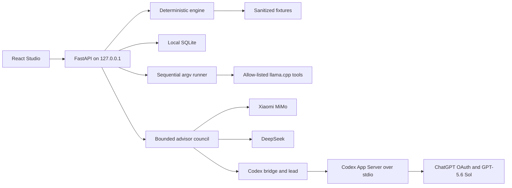

# Architecture

## Trust boundary

The engine owns coverage, protocol compatibility, budgets, latency, ranking,
verdicts, and structured commands. Each advisor receives only the user's intent
and a bounded `AnalysisReport`. Xiaomi and DeepSeek run concurrently. Their
responses are parsed against the same schema, recommendation ID, and numeric
grounding rules before GPT receives them. GPT may synthesize accepted opinions
but cannot add an ID, change the recommendation, or introduce an unsupported
number. Partial provider failure degrades to the remaining members or the
deterministic explanation.

## Core contracts

- `ProtocolFingerprint`: instrument, model ID, immutable build ID, and all
  controlled flags. Total latency is computed only from compatible arms.
- `MeasuredRun`: one arm plus evidence grade, source hashes, placement budgets,
  and measured metrics.
- `AnalysisReport`: immutable deterministic output supplied to both UI and
  advisor.
- `CommandSpec`: executable, argv, environment, cwd, and timeout. It is never a
  shell string; PowerShell is a quoted export format only.
- `RunSpec` and `RunRecord`: sequential A/B intent and its captured process
  state, output tails, return codes, and initial VRAM.

## Verdict policy

- `ENABLE`: at least 3% measured improvement and budgets pass.
- `DISABLE`: at least 3% regression or a RAM/VRAM budget failure.
- `MEASURE`: guard-band result, missing data, incompatible protocols, circular
  ceiling, or isolation control.

No interpolation occurs outside an existing calibration interval. Estimated
values remain visibly estimated.

## App Server protocol

The backend starts `codex app-server` directly over stdio. On Windows it invokes
the installed Node entrypoint because an npm `.cmd` shim cannot be spawned by
`asyncio` without a shell. It uses `account/read` and `account/login/start` with
ChatGPT auth, then starts an ephemeral GPT-5.6 Sol thread with:

- an empty Studio-owned scratch directory;
- read-only sandbox;
- approval policy `never`;
- no local project files, model data, prompt history, or credentials.

If App Server fails, `codex exec --ephemeral` implements the same schema and
validation. If Codex or login is unavailable, the deterministic explanation is
returned offline.

## Provider and secret boundary

Xiaomi and DeepSeek use OpenAI-compatible HTTPS endpoints configured from
environment variables. Redirects, URL credentials, non-HTTPS remote URLs,
oversized responses, unknown experiment IDs, and ungrounded numeric claims are
rejected. Keys are held only by the Studio process and are not included in
reports, member results, logs, SQLite, exports, or child process environments.
Error bodies from providers are not returned to the UI.

Run specifications reject secret-like values and sensitive flag names. Runner
output is redacted before persistence. The runner allows only known llama.cpp
executables, uses argv execution without a shell, and prevents `llama-server`
from binding beyond loopback.

## Deployment modes

- Windows release: PyInstaller `onedir`, random free loopback port, browser open.
- Source: same FastAPI app with built Vite assets.
- Hosted Space: fixture-only mode on port 7860; login and runner endpoints are
  disabled and no secret is required.
